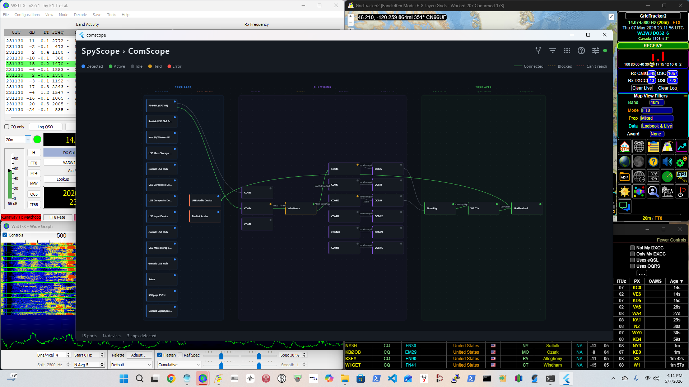
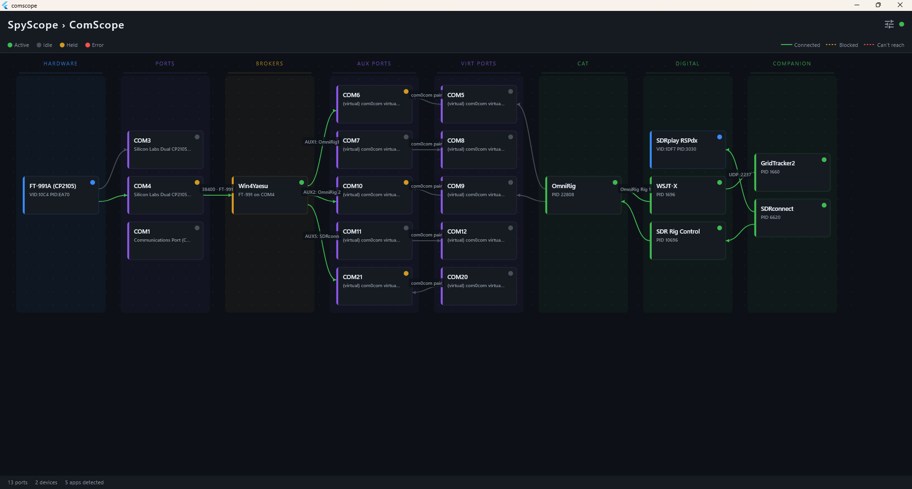
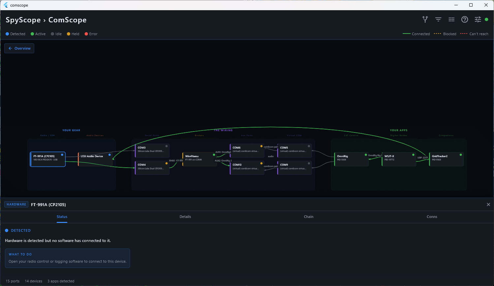
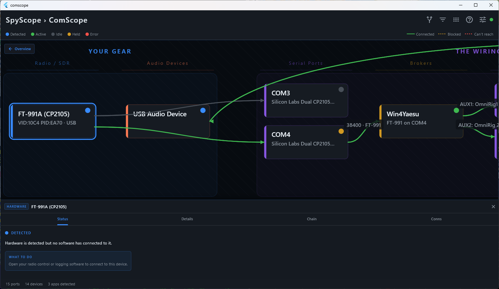
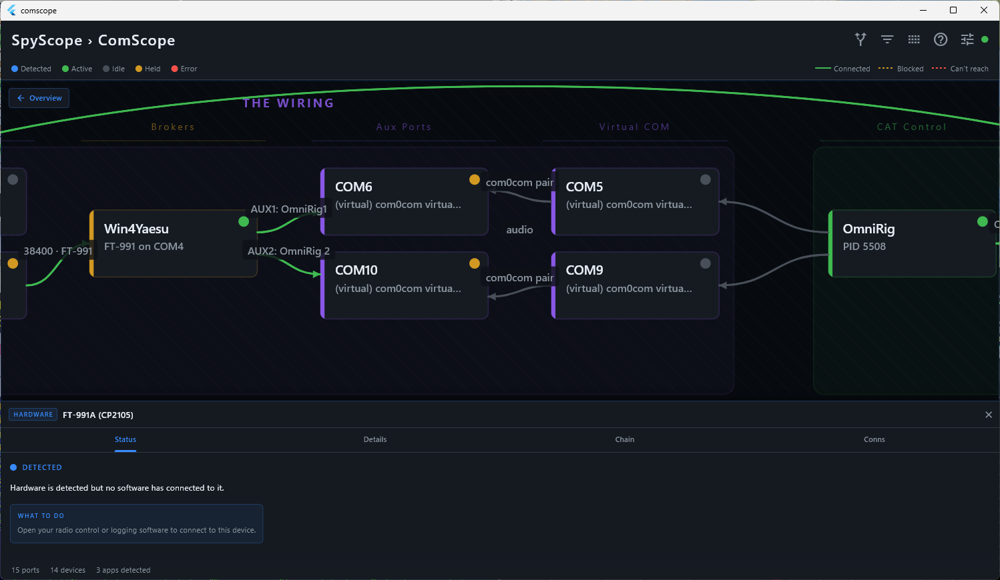
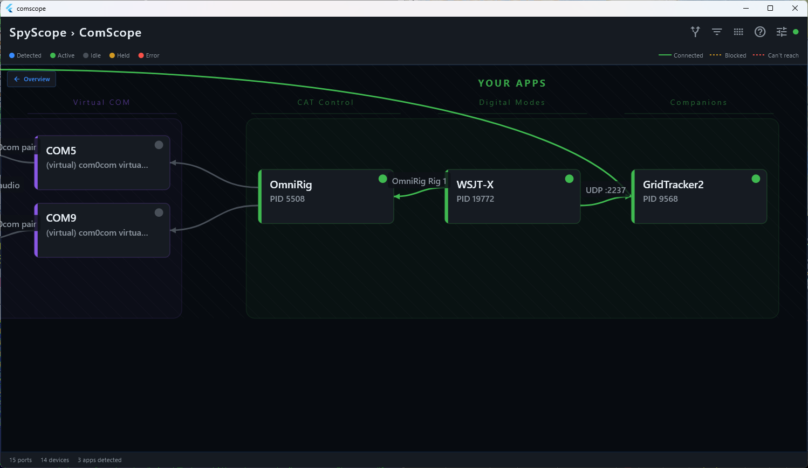

# ComScope

Real-time shack topology visualizer for Windows.

ComScope discovers what's connected to your machine and draws the full signal chain — radio hardware → COM ports → brokers → apps — as a live diagram. No configuration file. It reads the machine state directly.

## What it detects

- **USB hardware** — identified by VID/PID against a catalog of 50+ ham radio devices
- **COM port ownership** — which process holds each port, live
- **Broker connections** — Win4Yaesu, OmniRig, rigctld, flrig via TCP
- **Audio chain** — sound devices, virtual cables (VB-Audio, VAC, Voicemeeter), active audio sessions

## Radio + SDR

ComScope handles multiple hardware chains simultaneously. Here, an FT-991A and SDRplay RSPdx are detected and wired independently.

## FT8 Configuration

A typical FT8 night: FT-991A → COM ports → Win4Yaesu → OmniRig → WSJT-X, with audio routing visible.

| | | |
|---|---|---|
|  |  |  |

## Requirements

- Windows 10 or 11
- No Python required — self-contained installer

## Install

Download the installer from [Releases](../../releases) and run it. No admin required.

## Status

Early but functional. Tested with FT-991A, SDRplay RSPdx, Win4Yaesu, OmniRig, WSJT-X, SDR Console, Log4OM.

macOS build planned. Windows is the primary target for now.

---

73, Pete Parise KO6BJY
